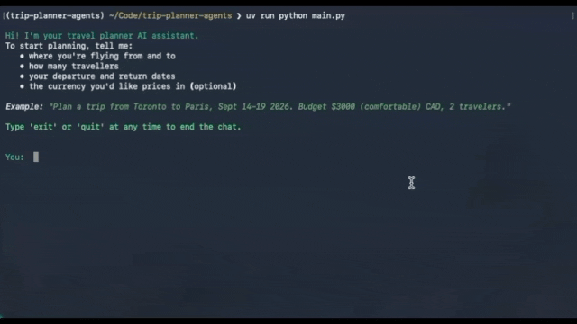

# trip-planner-agents
A trip planner built as a LangGraph `StateGraph`, routing between flight and hotel search agents, budget evaluation with automatic tier downgrades, and multi-turn conversation handling (re-searching, adjusting budget, answering destination questions) to produce a markdown itinerary. Terminal-based MVP, built incrementally.



## Features

- Parses trip details (origin, destination, dates, travelers, currency, budget, budget tier) from natural language, validates them, and asks for corrections when needed.
- Searches flights via the Kiwi MCP server and hotels via the Trivago MCP server.
- Evaluates the picked flight/hotel against the budget and automatically downgrades the budget tier (comfortable → balanced → cheapest) when over budget, retrying failed searches up to a configurable limit.
- Handles multi-turn follow-ups: re-search with new criteria, adjust the budget, ask advisory questions about the destination, or finalize the itinerary.
- Renders the final itinerary as markdown, with a budget summary, in the terminal.

## Requirements

- Python 3.12+
- [uv](https://docs.astral.sh/uv/) for dependency management
- An OpenAI API key

## Setup

1. Clone the repo.
2. Install dependencies:
   ```
   uv sync
   ```
3. Copy `.env.example` to `.env` and fill in the required variables (`OPENAI_API_KEY`, `OPENAI_MODEL`, `MCP_KIWI_URL`). Optional variables (timeouts, colors, LangSmith tracing) have sane defaults.

## Usage

Run the planner:
```
uv run main.py
```

Describe your trip in one message, e.g.:
> Plan a trip from Toronto to Paris, Sept 14-19 2026. Budget $3000 (comfortable) CAD, 2 travelers.

The assistant gathers any missing details, searches flights and hotels, and prints a markdown itinerary. You can keep chatting to refine it — ask for a cheaper option, request a new search, or ask questions about the destination — until you're ready to finalize. Type `exit` or `quit` to end the session.
